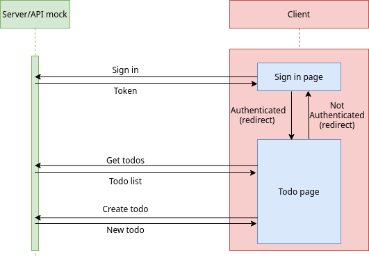

# Draggable Todo App

A React, Typescript draggable todo app with Mock API and Unit Testing

[Live Demo](https://draggable-todo-app.quang.work) :point_left:

## Getting started
- Run ```yarn``` or ```npm install``` if this is the first time you clone this repo (`master` branch).
- Run ```yarn start:frontend``` to start this project in development mode.
- Sign in using username: `firstUser`, password: `123`

### App diagram


